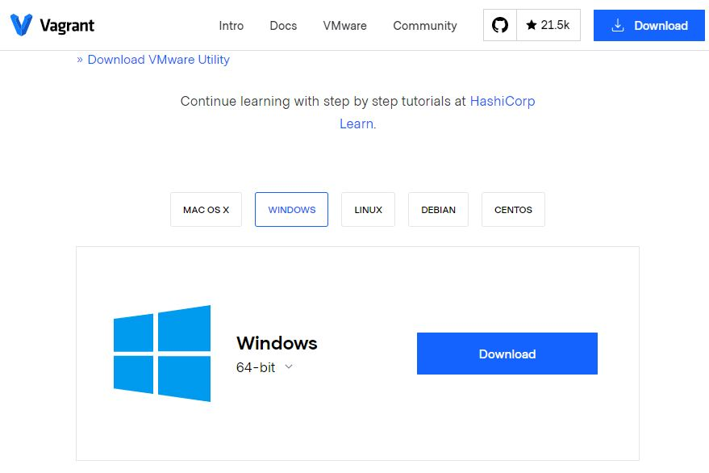
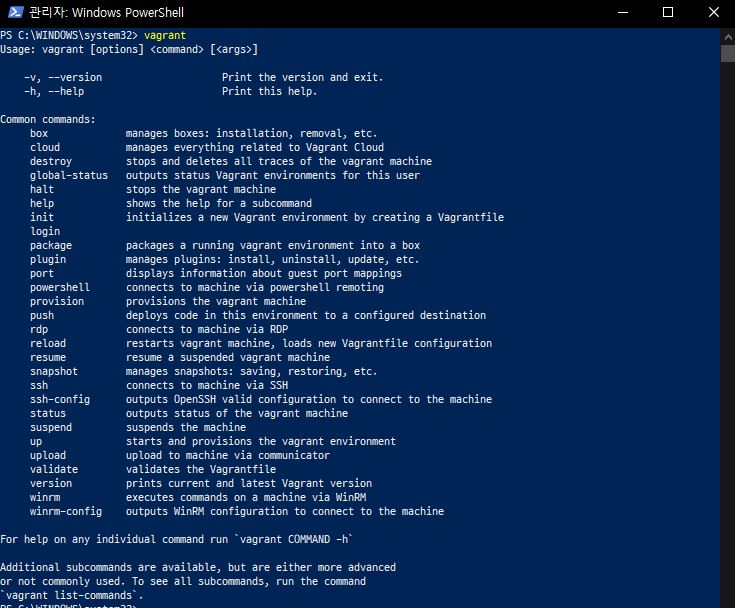
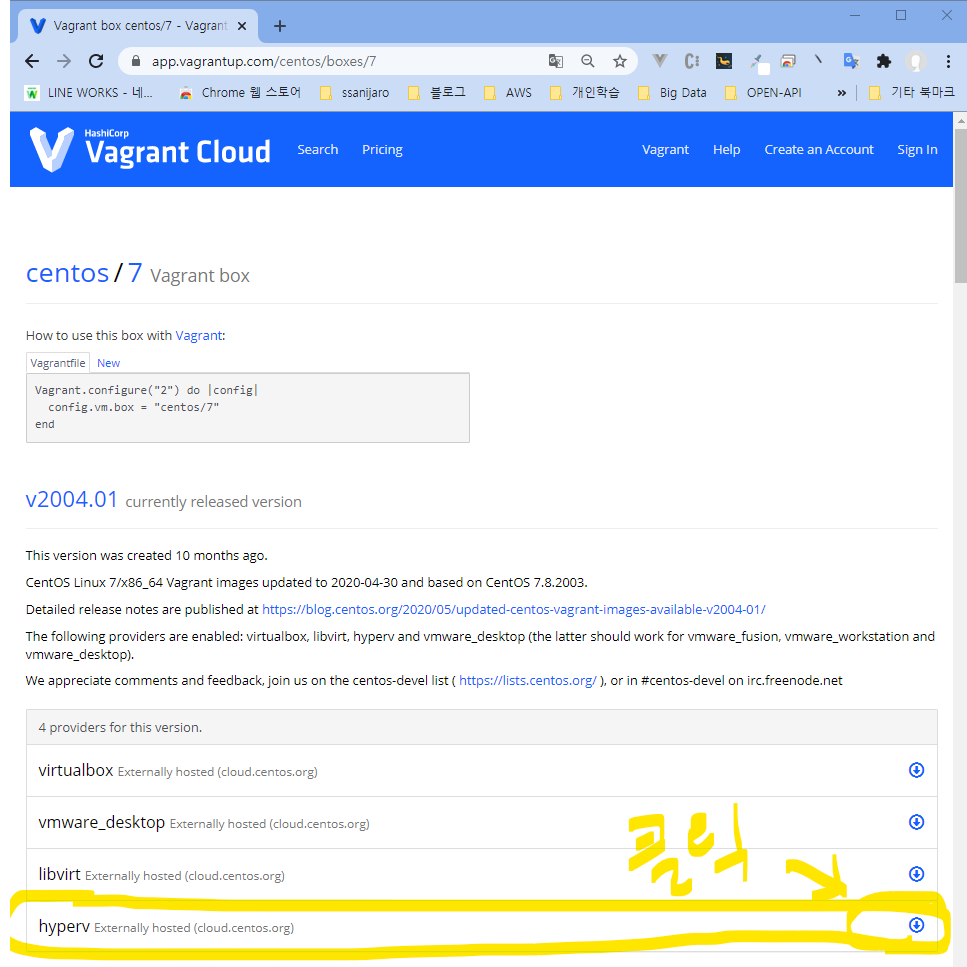
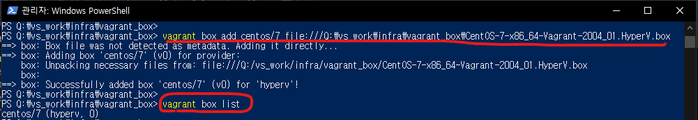
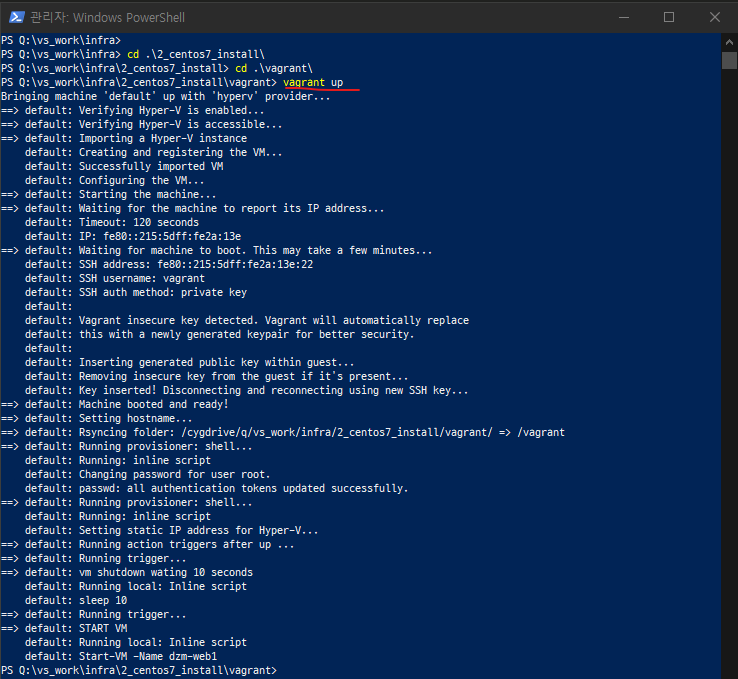
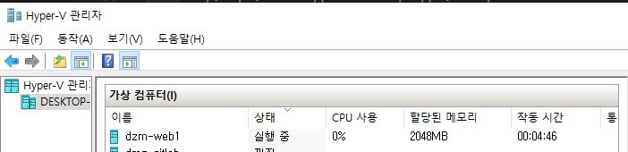
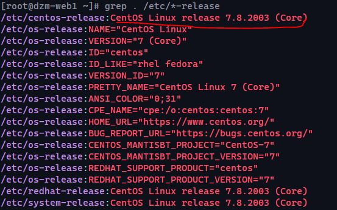

# Windows10 Hyper-V: CentOS 7 Install using Vagrant

## Vagrant 설치

> [Download Vagrant 링크](https://www.vagrantup.com/downloads)



> 설치 확인

```
vagrant -version
```




## Hyper-V용 centos/7 box 다운로드 하기.

다운로드 주소: https://app.vagrantup.com/centos/boxes/7



## 다운로드한 box add 하기

1) q 드라이브,
2) file:///Q:\vs_work\infra\vagrant_box\폴더에
3_ CentOS-7-x86_64-Vagrant-2004_01.HyperV.box 파일을 받았다고 가정.
```
vagrant box add centos/7 file:///Q:\vs_work\infra\vagrant_box\CentOS-7-x86_64-Vagrant-2004_01.HyperV.box
```


## box list 조회하기

```
vagrant box list

------------------
centos/7         (hyperv, 0)
```

## hyper-v 로  CentOS/7 만들기

> 반드시, PowerShell 관리자 모드에서  1_vagrant_centos7_base/1_vagrant 폴더로 이동 후 아래 명령어를 수행 해야 함

```
# 이동
cd 1_vagrant_centos7_base/1_vagrant

# vm 올리기
vagrant up
```




## Console 접속

```
vagrant ssh
```

## OS 운영체제 및 버전확인

```
grep . /etc/*-release
```


## vagrant 삭제

```
vagrant destory
```

## 기본 패키지 설치

```shell
yum groupinstall -y "Development tools"
yum -y vim wget curl telnet net-tools bind-utils

# 캐시 삭제
yum clean all
```

## 기본 패키지가 설치된 box 를 export 하기.

> Ingra 구성 테스트시, 매번 같은 패키지를 설치하는게 귀찮아서
> 아래 기본 패키지를 설치한 box 를 export 하여 사용 하자

```shell
vagrant package --output CentOS-7-x86_64-Vagrant-Base.HyperV.box
```

## box add 하기

```shell
vagrant box add centos_base/7 ./CentOS-7-x86_64-Vagrant-Base.HyperV.box
```

## box add 확인

```
vagrant box list

----------------------
centos_base/7    (hyperv, 0)
```

## 참고

> root password = vagrant